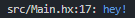

# Refreshed-Logging
 A cool and hip new way to log to your console with haxe! <br>
 All the kids are logging their work this way, so you should too!

 If you're new to haxelibs the quickest way to install this is to run the following command from a terminal:
 ```bash
  haxelib install refreshed_logging
 ```
 ## How to use it?
  Well there's this handy feature called "wildcard" importing, where you can use a `.*` at the end of an import to include all static functions and variables from a class. We can use this with our `Logger` class to have it feel like we never even moved from the classic trace statement. 

  At either the top of your class, or using an `import.hx` file; include the following line:
  ```haxe
import refreshed_logging.Logger.*;
  ```
 Now you too can use the hip new log methods without needing all that instance getting and other junk of the `Log` class (which has been kept public so you can still mess with, I want my users to have complete creative freedom with this).
<br><br>

 ### ANSI 
 <sub> (Some prerequisite knowledge for the logger, **only** for if you wish to mess with colors while logging.)</sub> <br>

 Ansi is the way in which terminals are controlled/displayed, and therefore we can change a few things while logging. If you pay attention to the `AnsiColors` enum, you'll notice an abstract called `AnsiStyle`. This is how we are going to be changing not only colors, but also how the test is displayed in the terminal. In `Ansi.hx` you can find a bunch of abstracts and classes which become utility for working with ansi. An enum named `Attributes` gives you a list of values which each control certain things when working with Ansi Styles. You can choose to either memorise these integer values, or call them from the enum itself. 
 
 While working with Attributes, you can get them from inside a string to have them auto translate to become their ANSI escape value. 

 You can also use the Refreshed Escape key to shorthand your ANSI calls. When you wish to add an ANSI value into a string, simply use a `` ` `` followed by a hex value of 2 digits. This hex value will correspond directly to an ANSI Attribute. You can use this to set colors of the string or set it's formatting.

 An example of this would be:
 ```haxe
  Logger.info("`0x22hey!"); // -> \033[34mhey!
 ```
 This show's the following result:<br>

 You can also specify an **Hexadecimal** color using RGB within your strings. This is done in the same vain but with a 6 digit hex instead.
<br><br>


 ### Log Levels
  Each native log function has a parent `LogLevel` instance. (You can find examples of how to create these in [`Log`](https://github.com/saturn-volv/Refreshed-Logging/blob/main/src/refreshed_logging/logging/Log.hx))

  All native log level functions can actually be overriden, as they are not final nor are they private. So you can create your own instances of these log levels, either by overriding the `LogFunction` instance in `Log` or you can override them by just creating new log levels with the same name. When creating a log level, you can choose to include your own callback, so that's your time to shine and create your own fancy new logging methods!

  You can create your own log levels, and can change the display name, or even the color of what is logged! To create your own, just follow this handy example:
  ```haxe
var customLogLevel = new LogLevel("custom_loglevel", AnsiColors.CYAN);
  ```
  Thats right! It's just *that* simple, now you can log to the console with ur very own color and name! Now if you want to log using it, just create ur own function like so:
  ```haxe
    public static function customLog(v:Dynamic, ?infos:Null<PosInfos>) {
        customLogLevel.callback(v, infos);
    }    
        // Or if you aren't in the same scope as your log level, there is a permanent instance saved always:
        LogLevel.levelMap.get("custom_loglevel").callback(v, infos);
  ```
<br><br>

  ### Customization
  You can create your own formattings and defaults for your project, including changing what the default function trace callback is. 

  #### Changing the `trace` Log Function
  The logger has the option for a user to create or use their own custom log functions with ease, and everytime a `trace()` is called, it will default to this function instead.

  Changing the default trace callback is as simple as so:
  ```haxe
  Logger.selectedLogFunction = customLog;
  ```

  #### Changing the Log Format
  The logger has the functionality to allow for the user to implement their own format for logging to the console. This will be the format that all logs default to, including a standard trace call.

  You can change this with either your own function *or* a simple arrow function variable. Examples of this can be found in the `formatting.LogFormats` class, as well as some other options for formats built in as defaults you can choose to change between.

  Changing the default format is as such:
  ```haxe
    Logger.selectedLogFunction = (input, ?infos, level) -> {
        return '> ${level.color}${input}';
    };
  ```
  ```haxe
  trace("Hello World!"); // "> Hello World!"
  ```

